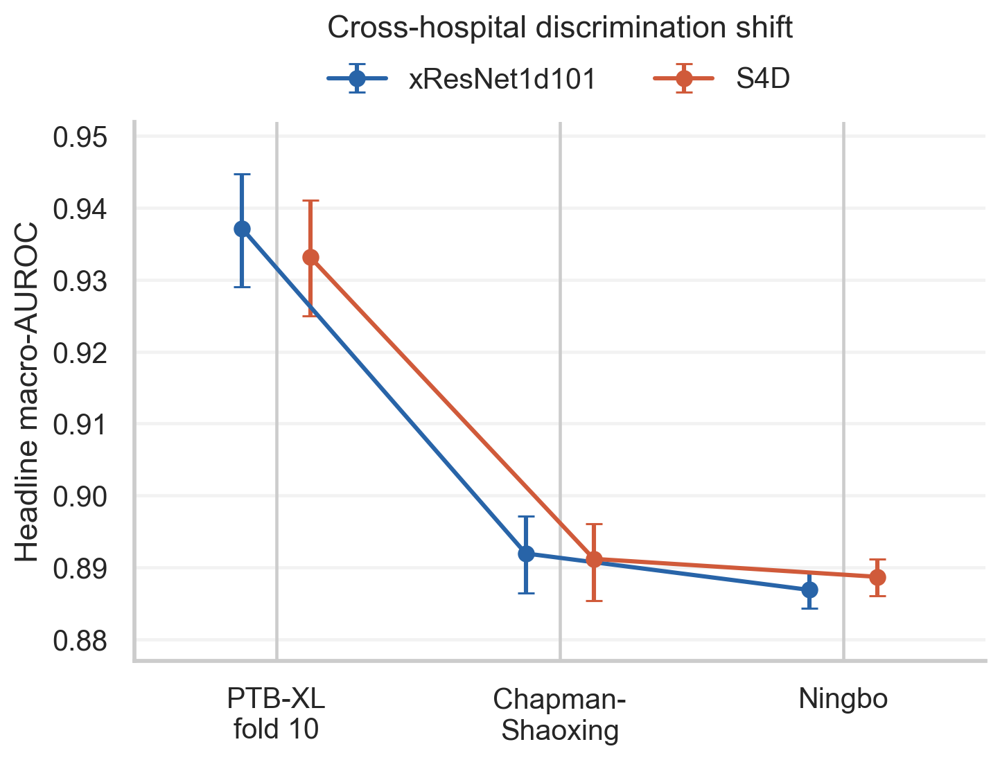
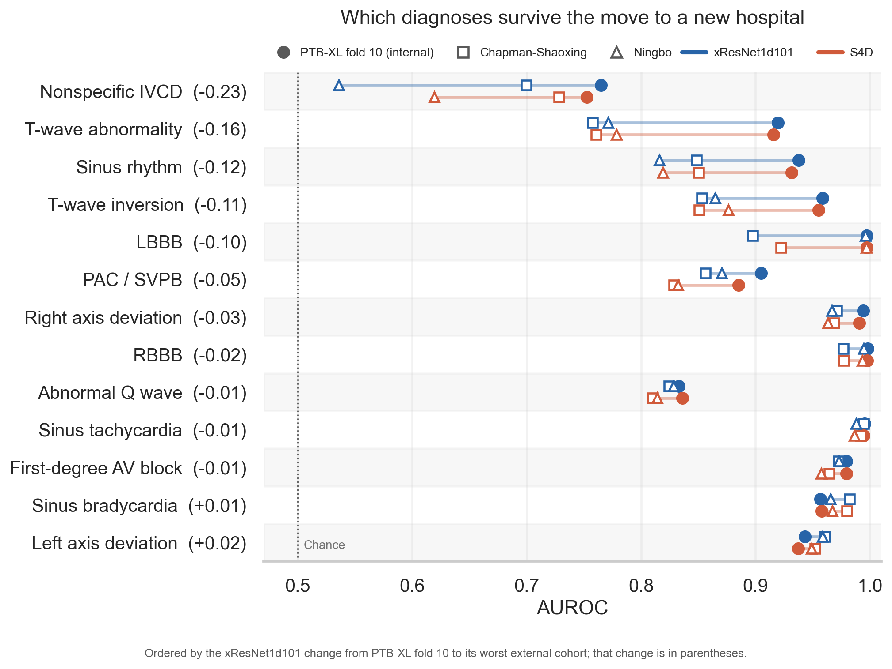

# Cross-hospital generalization and calibration for 12-lead ECG classification

Two architectures, xResNet1d101 (convolutional) and S4D (diagonal state-space), trained on PTB-XL and evaluated in a single sealed inference pass on held-out PTB-XL fold 10 and two external hospital cohorts, Chapman-Shaoxing and Ningbo. External cohorts are reported separately at every stage, never pooled.

## Headline results

Term-centric macro-AUROC over 13 headline labels, 95% percentile intervals from a 2,000-replicate cluster bootstrap.

| Cohort | xResNet1d101 | S4D |
|---|---|---|
| PTB-XL fold 10 (internal) | 0.9371 [0.9290, 0.9447] | 0.9331 [0.9250, 0.9410] |
| Chapman-Shaoxing (external) | 0.8919 [0.8864, 0.8971] | 0.8912 [0.8854, 0.8960] |
| Ningbo (external) | 0.8869 [0.8843, 0.8893] | 0.8887 [0.8860, 0.8912] |

Headline drop moving to either hospital: 0.042 to 0.050, every interval below zero.

Per label: rate findings, axis deviation, first-degree AV block and right bundle branch block hold within 0.03 of internal. Interpretive findings lose 0.10 to 0.23 at their worst external cohort. Nonspecific intraventricular conduction disorder 0.765 internal to 0.536 [0.514, 0.559] on Ningbo. T-wave abnormality 0.920 to 0.758 on Chapman-Shaoxing.

Secondary metrics, calibration before and after temperature scaling, thresholded operating points, age and sex subgroups, sparse-target coverage and full per-label tables: `RESULTS.md`.

## Registered hypothesis

Registered: the S4D ensemble exceeds the xResNet ensemble internally and in each hospital. Not supported. S4D minus xResNet1d101: -0.0040 [-0.0094, +0.0013] fold 10, -0.0008 [-0.0047, +0.0027] Chapman-Shaoxing, +0.0018 [-0.0001, +0.0037] Ningbo.

Within the frozen 50-epoch budget, xResNet1d101 selected epochs 41, 45, 49 across three seeds, finishing within 0.0022 of best. S4D peaked at epochs 13, 10, 11 and decayed 0.0289 to 0.0316 under its registered constant-learning-rate recipe. Both selected on fold 9 by the same registered rule. This is a contrast between two training recipes, not between architectures each at its own optimum.

## Post-seal exploratory analyses

Dated and labeled where they appear, in `RESULTS.md` sections 4 and 7 to 10. None changes a registered quantity.

- Per-label intervals, computed on the registered resamples.
- Label commensurability: restricting sinus rhythm to records with no competing rhythm label turns its Chapman-Shaoxing change from -0.089 [-0.105, -0.073] to +0.062 [+0.045, +0.079]; three controls given the same treatment do not recover.
- Handcrafted-feature logistic regression over 22 waveform measurements: macro-AUROC 0.8562 [0.8450, 0.8673] fold 10, 0.8119 [0.8056, 0.8182] Chapman-Shaoxing, 0.8294 [0.8263, 0.8324] Ningbo; reproduces the per-label transfer ordering at Spearman 0.593 (p = 0.033) and 0.516 (p = 0.071).
- Calibration ladder: one additive logit offset per label removes 70.7 to 75.3 percent of external error, the most flexible multiplicative correction 21.8 to 26.5 percent.
- Decision curve: one label and hospital worse than treating no one, nonspecific intraventricular conduction disorder on Ningbo, net benefit -0.0045 [-0.0049, -0.0041] at threshold probability 0.10.

## Seals

Analysis plan, harmonized label space, primary and secondary metrics, calibration and subgroup analyses, and bootstrap design were committed before the first model was fitted.

- `preregistration/SEAL.json`: registration commit and SHA-256 digests of the analysis plan, machine-readable protocol, and label manifest.
- `results/EVALUATION_SEAL.json`: selected checkpoints, per-label operating thresholds, one scalar temperature per architecture, all derived from fold 9 alone. Committed before the single inference pass over the protected cohorts.

Training, protected inference, and analysis refuse to run unless the seals verify, against working-tree files and, where an object store holding the sealed commits is present, against sealed blob content. Both seals record `history_rewritten: true`. The seal files and their history are local and mutable, and nothing is externally notarized. `METHODOLOGY.md` section 1 states the coverage of each check.

## Layout

| Path | |
|---|---|
| `preregistration/` | analysis plan, registration seal |
| `configs/` | machine-readable protocol, sealed at registration |
| `src/ecg_clinical/` | harmonization, waveform handling, models, metrics, bootstrap, seal verification |
| `scripts/` | pipeline entry points, one stage per script |
| `results/` | metric tables, uncertainty, reliability bins, evaluation seal, analysis manifest, inference receipts, `exploratory_`-prefixed outputs |
| `figures/` | PNG and PDF |
| `deviations/` | departures from the registered plan |
| `tests/` | 202 tests, run from a clean checkout with no data present |
| `data/derived/` | registration artifacts, label manifest, normalization constants, waveform audit |
| `runs/*/*/` | per-epoch curve and run manifest for each of the six runs |

Not committed: 1.5 GB waveform stores, 191 MB checkpoints, 28 MB sealed per-seed predictions. Receipts at `results/inference_receipts/` carry the SHA-256 digest of every sealed prediction file, ensemble, and selected checkpoint.

## Reproducing

Python 3.12, pinned in `pyproject.toml` and `uv.lock`. `uv sync`, or `uv sync --extra dev` for tests. No dataset file is committed and no manual download is required.

1. `scripts/fetch_source_metadata.py` (23.6 MB, verified against the sealed label manifest) and `scripts/fetch_challenge_headers.py` (66,989 waveform-free headers), then `scripts/build_preregistration_artifacts.py`
2. `scripts/build_waveform_store.py` and `scripts/audit_waveform_stores.py` (1.5 GB streamed from `physionet-open.s3.amazonaws.com`, checked against release checksums)
3. `scripts/compute_training_statistics.py`
4. `scripts/train_all.py`, driving `scripts/train_model.py` over six architecture and seed combinations
5. `scripts/freeze_evaluation_choices.py`, then commit and seal
6. `scripts/run_protected_inference.py` once per cohort (`ptb_test`, `chapman_shaoxing`, `ningbo`), one-time and idempotent by receipt
7. `scripts/analyze_results.py` and `scripts/plot_results.py`

Training: one Apple M4 via PyTorch MPS, 23.5 hours wall clock for six runs. Per-epoch timings in `METHODOLOGY.md` section 14. Tests: `uv run pytest`.

Seven exploratory stages sit outside the frozen analysis: `diagnose_ece_bootstrap_bias.py`, `compute_per_label_intervals.py`, `exploratory_label_commensurability.py`, `exploratory_transfer_mechanism.py`, `exploratory_clinical_utility.py`, `exploratory_calibration_ladder.py`, `exploratory_feature_baseline.py`. All but the first carry a post-seal date in the source header and summary file. None is required to reproduce a registered result.

## Data and licensing

Open access under CC BY 4.0, no credentialed access required. No dataset file is redistributed.

- PTB-XL 1.0.3: https://physionet.org/content/ptb-xl/1.0.3/ (Wagner et al., DOI 10.13026/kfzx-aw45)
- PhysioNet/CinC Challenge 2021 1.0.3: https://physionet.org/content/challenge-2021/1.0.3/ (Reyna et al., DOI 10.13026/34va-7q14)
- Chapman-Shaoxing and Ningbo (ECG Arrhythmia) 1.0.0: https://physionet.org/content/ecg-arrhythmia/1.0.0/ (Zheng et al., DOI 10.13026/wgex-er52)

`data/derived/` holds aggregate counts and constants adapted from PTB-XL metadata and the Challenge 2021 header snapshot under CC BY 4.0, with no record-level data. Citations in `METHODOLOGY.md` section 16. Code is MIT (`LICENSE`).

## Limitations

Headline labels were selected by a support rule requiring adequate counts in all three cohorts, so the estimand is conditional on diagnoses common to all three hospitals. S4D is a portability fallback for environments without the CUDA kernel extension full S4 requires, and is not evidence about full S4. No clinical deployment claim is made. Full section: `RESULTS.md` section 12.

## Benchmark context

Published PTB-XL numbers for these families (Strodthoff et al. for xResNet1d101, Mehari and Strodthoff for full S4) are computed on the native 71-statement task over the original release; this study uses a 13-label subset of the harmonized Challenge 2021 SNOMED scored space on duplicate-cleaned PTB-XL 1.0.3. Different tasks, different label spaces.

Leinonen et al. 2024 report a macro-AUC mean error of 0.0529 between within-source 5-fold cross-validation and an unseen source, against internal-to-external drops of 0.042 to 0.050 here. `RESULTS.md` section 11 and `METHODOLOGY.md` section 15.
